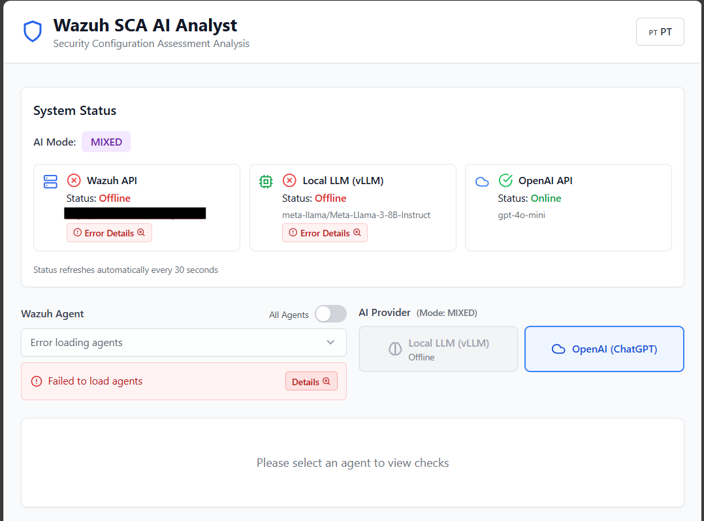
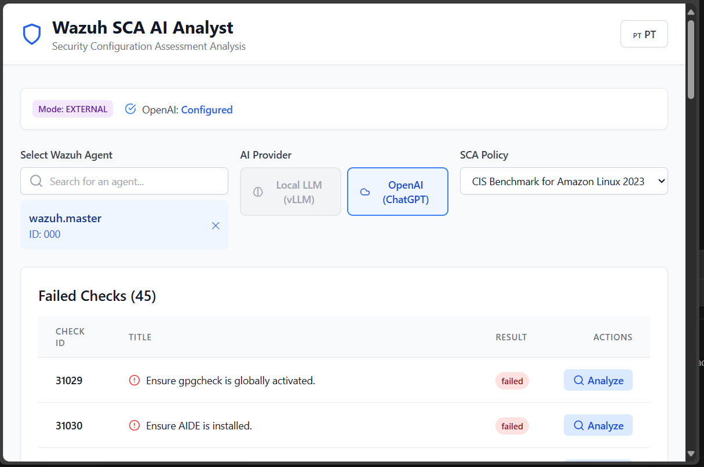
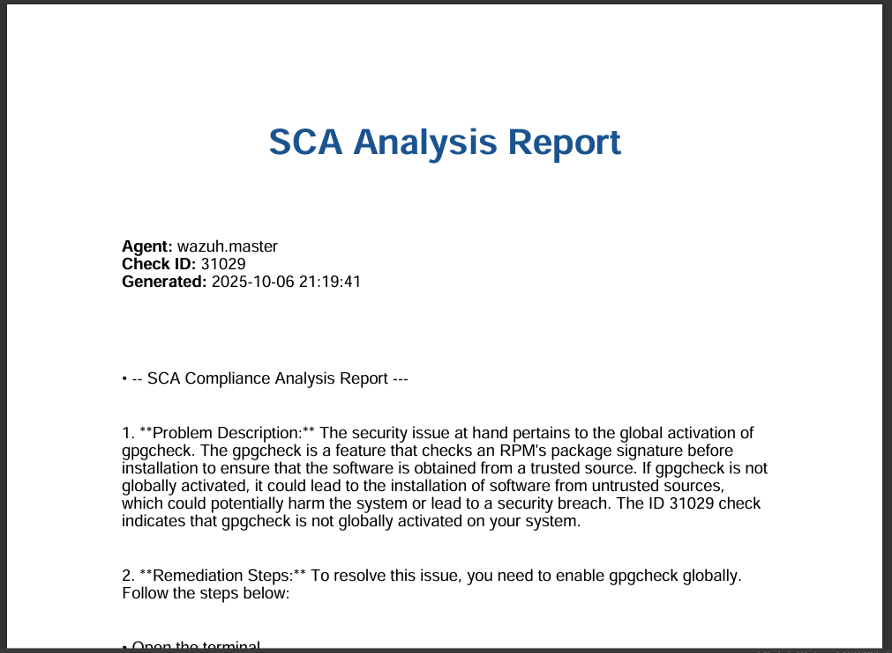
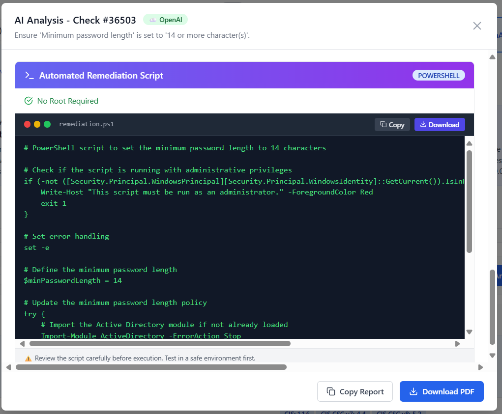

# Wazuh SCA AI Analyst


**AI-powered SCA analysis** for Wazuh with automated remediation scripts and intelligent caching.

> ⚠️ **Disclaimer**: AI recommendations are suggestions. Always test in development before deploying to production.

---

## ✨ What's New in v3.0

### 🔧 Automated Remediation Scripts
- **AI-generated executable scripts** for each failed check (bash/PowerShell/Python)
- **Terminal-style viewer** with macOS window controls (🔴 🟡 🟢)
- **One-click download** — ready-to-run scripts
- **Safety features**: Privilege detection, risk warnings, and validation commands

### 🔗 Shared Cache System
- **Cross-agent analysis reuse** — analyze once, use everywhere
- **Smart caching**: Agent-specific + shared cache strategies
- **Cost optimization**: Up to 98% reduction in AI API calls
- **Visual indicators**: Purple badge shows “cached from another agent”

### 🎨 Enhanced UI/UX
- **Smart error modals** with zoom-in details and troubleshooting steps
- **Professional script display** with syntax highlighting
- **Improved performance** indicators and status monitoring

📚 **[Full Changelog](CHANGELOG.md)** | 📖 **[Documentation](docs/)**

---

## 🚀 Quick Start

```bash
git clone https://github.com/mjvmsteixeira/Wazuh-CSA-Bot.git
cd Wazuh-CSA-Bot
make quickstart
# Edit .env
make up
```

**Access:** http://localhost:3000

---

## 📋 Requirements

- Docker & Docker Compose  
- Accessible Wazuh Manager  
- **For Local AI**: NVIDIA GPU + CUDA (~8GB VRAM)  
- **For External AI**: OpenAI API Key  

---

## ⚙️ Configuration

### 1. Create Environment

```bash
make setup-env
```

### 2. Edit `.env`

**Wazuh (required):**
```env
WAZUH_API_URL=https://your-wazuh:55000
WAZUH_USER=wazuh
WAZUH_PASSWORD=your-password
WAZUH_VERIFY_SSL=false
```

**AI Mode (choose one):**
```env
# Option 1: Local only (GPU required, no costs)
AI_MODE=local

# Option 2: OpenAI only (no GPU, API costs apply)
AI_MODE=external
OPENAI_API_KEY=sk-proj-...

# Option 3: Mixed (maximum flexibility)
AI_MODE=mixed
OPENAI_API_KEY=sk-proj-...
```

**App:**
```env
SECRET_KEY=change-in-production
```

### 3. Download Model (for local/mixed modes)

```bash
make download-model  # ~4.9GB
```

### 4. Start

```bash
make up
```

---

## 🎯 AI Modes

| Mode | vLLM Container | OpenAI | When to Use |
|------|----------------|--------|--------------|
| `local` | ✅ Required | ❌ | GPU available, no API costs |
| `external` | ❌ Not started | ✅ Required | No GPU, accept API costs |
| `mixed` | ✅ Started | ✅ Optional | Choose per analysis |

---

## 📦 Commands

### Setup
```bash
make quickstart        # Interactive setup
make setup-env         # Create .env
make download-model    # Download model (~4.9GB)
make check-ai-mode     # Verify configuration
```

### Operations
```bash
make up                # Start
make down              # Stop
make restart           # Restart
make ps                # Status
make logs              # View logs
make health            # Health check
```

### Cleanup
```bash
make clean             # Remove cache/containers
make clean-all         # Remove everything + model
```

### Help
```bash
make help              # All commands
make info              # Project info
```

---

## 🏗️ Architecture

```
Frontend (React) → Backend (FastAPI) → { vLLM (Local) }
  :3000                 :8000            { OpenAI (API) }
                          ↓
                     Wazuh API
                       :55000
```

## 🎯 Key Features

### Analysis & Reporting
- ✅ **AI-powered analysis** using local (vLLM) or cloud (OpenAI) models
- 📄 **Detailed reports** with context and remediation steps
- 🌍 **Multi-language** support (Portuguese, English)
- 📊 **PDF export** for compliance documentation
- 📜 **Analysis history** with search and filtering

### Automation & Scripts
- 🔧 **Executable remediation scripts** (bash, PowerShell, Python)
- 🖥️ **Terminal-style viewer** with syntax highlighting
- ⚡ **One-click copy/download** for instant execution
- ⚠️ **Safety metadata**: root requirements, estimated runtime, and risk level

### Performance & Caching
- 🔗 **Shared cache** — reuse analyses across agents
- ⚡ **Agent-specific cache** for repeated checks
- 💾 **Persistent storage** in SQLite
- 📈 **Cost optimization** — up to 98% fewer API calls

### User Experience
- 🎨 **Modern React UI** with live updates
- 🔍 **Smart error handling** with troubleshooting tips
- 📊 **System status dashboard** for all services
- 🏷️ **Visual indicators** for cache, provider, and analysis status

---

## 📱 Usage

1. Access http://localhost:3000  
2. Select Wazuh Agent and SCA Policy  
3. Choose AI Provider (if mixed mode)  
4. Click **Analyze** on failed checks  
5. View analysis, recommendations, and **remediation scripts**  
6. Download scripts or export PDF reports  
7. **Reuse analyses** automatically across similar checks  

---

## 📁 Structure

```
Wazuh-CSA-Bot/
├── backend/           # FastAPI
│   ├── app/
│   │   ├── api/       # Routes
│   │   ├── services/  # AI + Wazuh
│   │   ├── models/    # Schemas
│   │   └── config.py
│   └── Dockerfile
├── frontend/          # React
│   ├── src/
│   │   ├── components/
│   │   ├── pages/
│   │   ├── services/
│   │   └── i18n/      # PT/EN
│   └── Dockerfile
├── models/            # AI models
├── docker-compose.yml
├── Makefile
└── .env
```

---

## 🐛 Troubleshooting

### vLLM not starting
```bash
nvidia-smi              # Check GPU
make check-model        # Verify model
make logs-vllm          # View vLLM logs
```

### Backend issues
```bash
make check-ai-mode      # Validate configuration
make logs-backend       # View backend logs
make test-wazuh         # Test Wazuh connection
```

### Port already in use
```bash
make down
make clean
make up
# or
make up-cache # using Redis
```

### Full reset
```bash
make clean-all
make setup-env
# Edit .env
make download-model
make up
# or
make up-cache # using Redis
```

---

## 📈 Performance & Cost Savings

### Shared Cache Benefits (v3.0)

**Scenario**: 50 servers with identical SCA policy

| Metric | Without Cache | With Shared Cache | Savings |
|--------|---------------|-------------------|----------|
| **Time** | 150 seconds | 8 seconds | **94% faster** ⚡ |
| **AI API Calls** | 50 calls | 1 call | **98% fewer calls** 💰 |
| **Response Time** | 3s per check | <100ms cached | **97% faster** 🚀 |

### Cache Strategy

1. **Agent-specific cache** – highest priority, per-agent results  
2. **Shared cache** – fallback, reuse from any agent with same check  
3. **TTL-based expiration** – configurable freshness (default: 24h)

### Visual Indicators

- 🔵 **Agent-specific cache** – same agent, same check  
- 🟣 **Shared cache** – different agent, same check (with badge)  
- 🆕 **New analysis** – no cache, fresh AI generation  

---

## 🎓 Supported SCA Policies

The Wazuh Security Configuration Assessment (SCA) module performs scans to determine if monitored endpoints meet secure configuration and hardening policies. These scans assess the endpoint configuration using policy files. These policy files contain rules that serve as a benchmark for the configurations that exist on the monitored endpoint.
[read more](https://documentation.wazuh.com/current/compliance/nist/configuration-assessment.html)

---

## 👤 Authors

**Original Tool:** [Hazem Mohamed](https://wazuh.com/ambassadors/hazem-mohamed/) - [Repo](https://github.com/Hazematiya2023/Wazuh-CSA-Bot)
**Fork:** [@mjvmst](https://wazuh.com/ambassadors/marco-teixeira/) - [Fork](https://github.com/mjvmsteixeira)

---

## 📧 Support

- Issues: [GitHub Issues](https://github.com/mjvmsteixeira/Wazuh-CSA-Bot/issues)  
- Documentation: [Wiki](https://github.com/mjvmsteixeira/Wazuh-CSA-Bot/wiki)

---

## 📜 License

MIT License — see [LICENSE](LICENSE)
