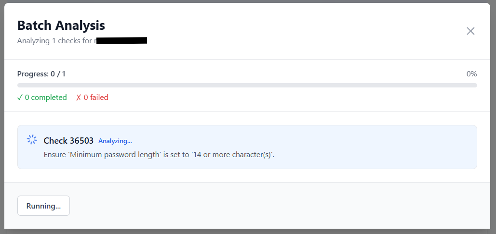

# Wazuh SCA AI Analyst


Análise inteligente de Security Configuration Assessment (SCA) do Wazuh usando AI local (vLLM) ou externa (OpenAI).

> ⚠️ **Disclaimer**: As recomendações fornecidas pela AI são sugestões. Teste sempre em ambiente de desenvolvimento antes de produção.

---

## 🚀 Quick Start

```bash
git clone https://github.com/mjvmsteixeira/Wazuh-CSA-Bot.git
cd Wazuh-CSA-Bot
make quickstart
# Editar .env
make up
```

**Acesso:** http://localhost:3000

---

## 📋 Requisitos

- Docker & Docker Compose
- Wazuh Manager acessível
- **Para AI Local**: NVIDIA GPU + CUDA (~8GB VRAM)
- **Para AI Externa**: OpenAI API Key

---

## ⚙️ Configuração

### 1. Criar Ambiente

```bash
make setup-env
```

### 2. Editar `.env`

**Wazuh (obrigatório):**
```env
WAZUH_API_URL=https://your-wazuh:55000
WAZUH_USER=wazuh
WAZUH_PASSWORD=your-password
WAZUH_VERIFY_SSL=false
```

**AI Mode (escolher):**
```env
# Opção 1: Apenas Local (GPU necessária, sem custos)
AI_MODE=local

# Opção 2: Apenas OpenAI (sem GPU, com custos)
AI_MODE=external
OPENAI_API_KEY=sk-proj-...

# Opção 3: Ambos (máxima flexibilidade)
AI_MODE=mixed
OPENAI_API_KEY=sk-proj-...
```

**App:**
```env
SECRET_KEY=change-in-production
```

### 3. Download Modelo (se local/mixed)

```bash
make download-model  # ~4.9GB
```

### 4. Iniciar

```bash
make up
```

---

## 🎯 Modos AI

| Modo | vLLM Container | OpenAI | Quando Usar |
|------|----------------|--------|-------------|
| `local` | ✅ Obrigatório | ❌ | GPU disponível, sem custos API |
| `external` | ❌ Não inicia | ✅ Obrigatório | Sem GPU, aceita custos |
| `mixed` | ✅ Inicia | ✅ Opcional | Escolher por análise |

---

## 📦 Comandos

### Setup
```bash
make quickstart        # Setup interativo
make setup-env         # Criar .env
make download-model    # Download modelo (~4.9GB)
make check-ai-mode     # Verificar configuração
```

### Operações
```bash
make up                # Iniciar
make down              # Parar
make restart           # Reiniciar
make ps                # Estado
make logs              # Ver logs
make health            # Health check
```

### Limpeza
```bash
make clean             # Limpar cache/containers
make clean-all         # Limpar tudo + modelo
```

### Ajuda
```bash
make help              # Todos os comandos
make info              # Info do projeto
```

---

## 🏗️ Arquitetura

```
Frontend (React) → Backend (FastAPI) → { vLLM (Local)  }
  :3000                 :8000            { OpenAI (API) }
                          ↓
                     Wazuh API
                       :55000
```

## 📱 Uso

1. Acesse http://localhost:3000
2. Selecione Agent e Policy
3. Escolha AI Provider (se mixed)
4. Click "Analyze" nos checks falhados
5. Veja análise e recomendações
6. Exporte PDF (opcional)

---

## 🔌 API REST

**Documentação interativa:** http://localhost:8000/docs

### Principais Endpoints

```python
# Agentes
GET  /api/agents
GET  /api/agents/{id}

# SCA
GET  /api/sca/{agent_id}/policies
GET  /api/sca/{agent_id}/checks/{policy_id}/failed

# Análise
POST /api/analysis
POST /api/analysis/stream
POST /api/analysis/batch

# Relatórios
POST /api/reports/pdf
```

---

## 📁 Estrutura

```
Wazuh-CSA-Bot/
├── backend/           # FastAPI
│   ├── app/
│   │   ├── api/       # Routes
│   │   ├── services/  # AI + Wazuh
│   │   ├── models/    # Schemas
│   │   └── config.py
│   └── Dockerfile
├── frontend/          # React
│   ├── src/
│   │   ├── components/
│   │   ├── pages/
│   │   ├── services/
│   │   └── i18n/      # PT/EN
│   └── Dockerfile
├── models/            # AI models
├── docker-compose.yml
├── Makefile
└── .env
```

---

## 🐛 Troubleshooting

### vLLM não inicia
```bash
nvidia-smi              # Verificar GPU
make check-model        # Verificar modelo
make logs-vllm          # Ver erros
```

### Backend com erros
```bash
make check-ai-mode      # Validar config
make logs-backend       # Ver logs
make test-wazuh         # Testar Wazuh
```

### Porta ocupada
```bash
make down
make clean
make up
```

### Reset completo
```bash
make clean-all
make setup-env
# Editar .env
make download-model
make up
```

---

## 🔐 Segurança

- ❌ Nunca commite `.env`
- ✅ Use secrets fortes em produção
- ✅ Configure SSL/TLS para Wazuh
- ✅ Limite acesso às APIs
- ✅ Revise permissões regularmente

---

## 🎓 Políticas SCA Suportadas

- Windows: `cis_win2016`, `cis_win2019`, `cis_win2022`
- Ubuntu: `cis_ubuntu20-04`, `cis_ubuntu22-04`
- RHEL: `cis_rhel8`, `cis_rhel9`
- Outras políticas CIS

---

## 💻 Desenvolvimento

### Backend Local
```bash
cd backend
python -m venv venv
source venv/bin/activate  # Windows: venv\Scripts\activate
pip install -r requirements.txt
uvicorn app.main:app --reload
```

### Frontend Local
```bash
cd frontend
npm install
npm run dev
```

---

## 📄 Variáveis de Ambiente

| Variável | Descrição | Default |
|----------|-----------|---------|
| `AI_MODE` | Modo AI: local/external/mixed | `mixed` |
| `WAZUH_API_URL` | URL Wazuh API | `https://127.0.0.1:55000` |
| `WAZUH_USER` | Utilizador Wazuh | `wazuh` |
| `WAZUH_PASSWORD` | Password Wazuh | - |
| `VLLM_API_URL` | URL vLLM service | `http://vllm:8000/v1` |
| `OPENAI_API_KEY` | OpenAI API key | - |
| `SECRET_KEY` | App secret key | - |

---

## 👤 Autores

**Tool Original:** [Hazem Mohamed](https://wazuh.com/ambassadors/hazem-mohamed/) - [Repo](https://github.com/Hazematiya2023/Wazuh-CSA-Bot)

**Web Version:** [mjvmsteixeira](https://github.com/mjvmsteixeira)

---

## 📧 Suporte

- Issues: [GitHub Issues](https://github.com/mjvmsteixeira/Wazuh-CSA-Bot/issues)
- Documentação: [Wiki](https://github.com/mjvmsteixeira/Wazuh-CSA-Bot/wiki)

---

## 📜 Licença

MIT License - ver [LICENSE](LICENSE)
